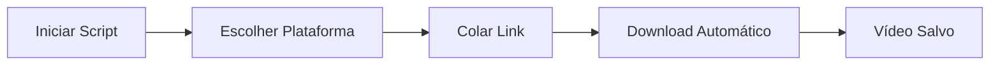

# 📱 Baixador de Vídeos

<div align="center">


Um script Python simples e eficiente para baixar vídeos de diversas plataformas populares diretamente para seu dispositivo Android.

[Funcionalidades](#-funcionalidades) •
[Instalação](#-instalação) •
[Como Usar](#-como-usar) •
[Exemplos](#-exemplo-de-uso)

</div>

---

## 📋 Descrição

Este projeto permite baixar vídeos do **YouTube**, **TikTok**, **Instagram** e **Kwai** de forma fácil e rápida através de uma interface de linha de comando intuitiva. Os vídeos são salvos automaticamente na pasta de Vídeos do seu dispositivo Android.

---

## ✨ Funcionalidades

- ✅ Download de vídeos de múltiplas plataformas
  - YouTube
  - TikTok
  - Instagram
  - Kwai
- 🎯 Interface interativa via terminal
- 📂 Criação automática da pasta de destino
- 🏷️ Salva os vídeos com o título original
- 🎬 Download na melhor qualidade disponível
- ⚡ Processo rápido e eficiente

---

## 🔧 Requisitos

### Requisitos do Sistema

| Requisito | Versão Mínima |
|-----------|---------------|
| Python | 3.6+ |
| Sistema Operacional | Android |

### Dependências

- `yt-dlp` - Ferramenta de download de vídeos

---

## 📦 Instalação

### Passo 1: Clone o Repositório

```bash
https://github.com/whesley264-oss/baixador-videos.git
cd baixador-videos
```

### Passo 2: Instale as Dependências

```bash
pip install yt-dlp
```

**Ou usando requirements.txt:**

```bash
pip install -r requirements.txt
```

---

## 🚀 Como Usar

### Execução do Script

1. **Execute o script:**
   ```bash
   python main.py
   ```

2. **Escolha a plataforma** digitando o número correspondente:
   - `1` → YouTube
   - `2` → TikTok
   - `3` → Instagram
   - `4` → Kwai

3. **Cole o link do vídeo** quando solicitado

4. **Aguarde o download** finalizar

### Fluxo de Uso



---

## 📁 Localização dos Vídeos

Os vídeos são salvos automaticamente em:

```
/storage/emulated/0/Videos
```

> **Nota:** A pasta será criada automaticamente caso não exista.

---

## 💡 Exemplo de Uso

```text
--- Baixador de Vídeos ---
Escolha a plataforma:
1. YouTube
2. TikTok
3. Instagram
4. Kwai
Digite o número da opção desejada: 1
Cole o link do vídeo aqui: https://www.youtube.com/watch?v=exemplo

Download concluído com sucesso!
Vídeo salvo em: /storage/emulated/0/Videos
```

---

## 🛠️ Estrutura do Código

### Funções Principais

| Função | Descrição |
|--------|-----------|
| `baixar_video(link, pasta_destino)` | Responsável pelo download do vídeo usando yt-dlp |
| `main()` | Gerencia a interface do usuário e fluxo do programa |

### Estrutura de Arquivos

```
baixador-videos/
│
├── main.py              # Script principal
├── README.md            # Documentação
└── requirements.txt     # Dependências
```

---

## ⚠️ Observações Importantes

> ⚡ **Atenção:** Leia com cuidado antes de usar!

- 📱 Este script foi desenvolvido especificamente para **dispositivos Android**
- 🔐 Certifique-se de ter **permissões de armazenamento** no dispositivo
- ⚖️ **Respeite os direitos autorais** ao baixar conteúdo
- ✅ Use apenas para conteúdo que você tem **direito de baixar**
- 🌐 Requer **conexão com a internet** para funcionar
- 💾 Verifique o **espaço disponível** antes de baixar vídeos grandes

---

## 🐛 Solução de Problemas

### Erro de Permissão

```bash
# Se encontrar erro de permissão, execute:
chmod +x main.py
```

### Erro de Instalação do yt-dlp

```bash
# Tente atualizar o pip primeiro:
pip install --upgrade pip
pip install --upgrade yt-dlp
```

### Vídeo Não Baixa

- Verifique se o link está correto
- Confirme se há conexão com internet
- Alguns vídeos podem estar protegidos ou restritos

---

## 📝 Licença

Este projeto está sob a licença **MIT**. Veja o arquivo [LICENSE](LICENSE) para mais detalhes.

```
MIT License - Uso Pessoal e Educacional
```

---

## 🤝 Contribuições

Contribuições são **muito bem-vindas**! 

### Como Contribuir

1. 🍴 Faça um Fork do projeto
2. 🔨 Crie uma branch para sua feature (`git checkout -b feature/NovaFuncionalidade`)
3. 💾 Commit suas mudanças (`git commit -m 'Adiciona nova funcionalidade'`)
4. 📤 Push para a branch (`git push origin feature/NovaFuncionalidade`)
5. 🔃 Abra um Pull Request

### O que você pode fazer

- 🐛 Reportar bugs
- 💡 Sugerir novas funcionalidades
- 📖 Melhorar a documentação
- ✨ Enviar pull requests

---

## 👨‍💻 Autor

Desenvolvido por Whesley com ❤️ para facilitar o download de vídeos.

---

## 📞 Suporte

Encontrou algum problema? Tem alguma dúvida?

- 📧 Abra uma [Issue](https://github.com/whesley264-oss/baixador-videos/issues)
- 💬 Entre em contato através das discussões do projeto

---

## ⭐ Mostre seu Apoio

Se este projeto foi útil para você, considere dar uma ⭐!

---

<div align="center">

**Desenvolvido com Python 🐍**

**[⬆ Voltar ao topo](#-baixador-de-vídeos)**

</div>
```
